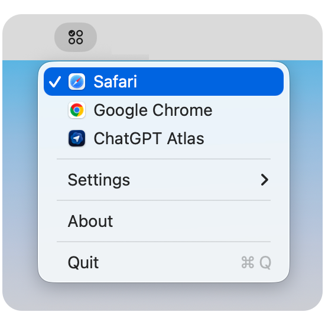

# Browser Switch (macOS Menu Bar App)

Browser Switch is a lightweight macOS menu bar utility that makes changing your default browser a one-click action.

If you regularly jump between Chrome, Safari, Arc, Firefox, or Edge for different tasks, Browser Switch removes the trip to System Settings and keeps your day moving along.

## Screenshot



Recommended shot: the open menu showing browser options, current checkmark, VPN/internet context rows, and settings actions.

## Why It’s Useful

- Save time: switch default browser instantly from the menu bar
- Stay focused: no System Settings navigation every time
- Work your way: quickly move between work, personal, and testing browser contexts
- Built for daily use: minimal UI, fast launch, no Dock clutter in normal use

## Features

- Menu bar app with no Dock presence during normal use
- Switch default browser for `http` and `https`
- Shows installed browsers dynamically (Safari/Chrome pinned first)
- Checkmark indicates the browser currently set by macOS
- De-duplicates duplicate browser entries by display name
- Internet context section in the menu:
  - VPN status from system network state (supports OpenConnect `utun` routes)
  - Green check icon when VPN is connected
  - ISP and location from `https://wtfismyip.com/json`
  - IP and Tor-exit values hidden unless the `Option` key is held
  - Network-change triggered refresh, throttled to at most once per minute
- About panel with app identity and copyright
- Settings menu:
  - Run on Startup
  - Scan for New Browsers
- Quit action from menu

## Install

Copy and paste this into Terminal:

```bash
curl -fsSL https://raw.githubusercontent.com/adamabernathy/browser-selector/main/scripts/install.sh | bash
```

This clones the repo to a temp directory, compiles a release build, copies the app to `~/Applications`, and cleans up after itself. Requires macOS 12+ and Xcode (or Command Line Tools with Swift 5.9+).

To uninstall:

```bash
rm -rf ~/Applications/Browser\ Switch.app
```

## Development

### Requirements

- macOS 12+
- Xcode or Apple Swift toolchain (Swift 5.9+)

### Build and run from Xcode

1. `File > Open...` and select this folder.
2. Select the `BrowserSwitchMenuBarApp` scheme.
3. Build and run.

### Build and run from Terminal

Useful for development logs and debugging. The process is attached to your terminal session:

```bash
swift build
swift run
```

### Build a standalone .app bundle

```bash
./scripts/build-app.sh --release --run
```

This creates `dist/Browser Switch.app` and opens it. You can also double-click the app from Finder.

### Run tests

```bash
swift test
```

## CI and Packaging

GitHub Actions workflows are included:

- `CI`: runs tests and release build on pushes/PRs
- `Package macOS App`: builds a downloadable `.app` zip artifact and publishes it on version tags (`v*`)

## License

Licensed under the MIT License. See `LICENSE`.
